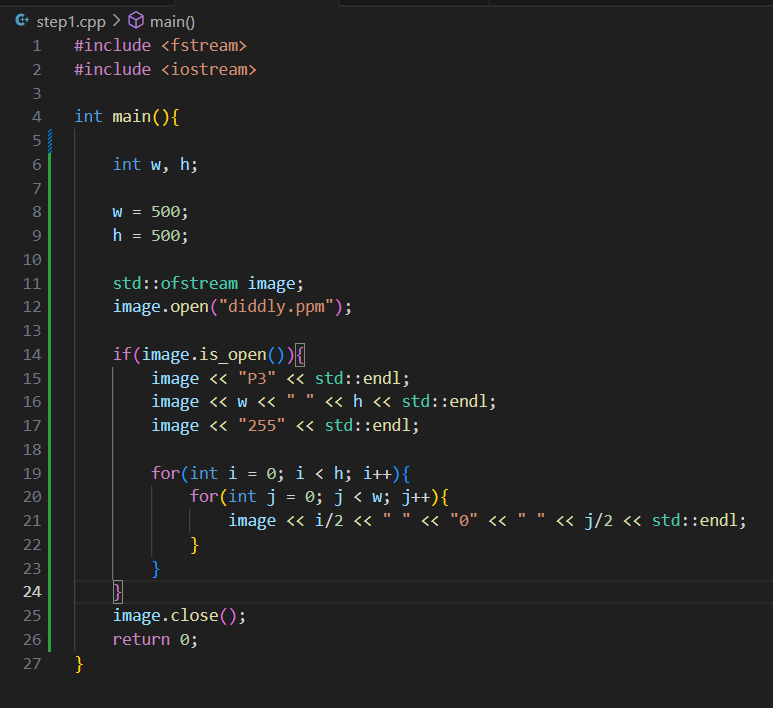
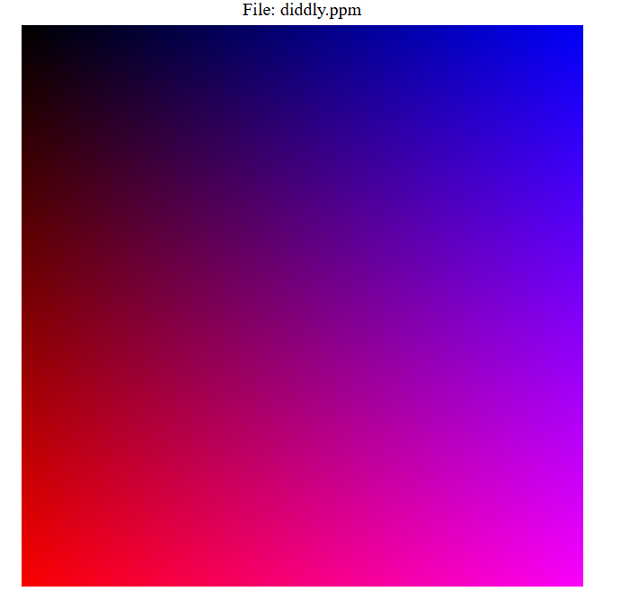

# MiniRayTracer
This is a small task I am assigning myself to improve my proficiency in C++. I will be using the tiny ray tracer tutorial (https://github.com/ssloy/tinyraytracer/wiki/Part-1:-understandable-raytracing) to guide the pathway of this assignment. I am going to write everything up without specifically using the details of the tutorial to the best of my ability, just using the path it follows as a sort of syllabus.  I hope to build on the knowledge I gain from this challenge to extend this ray tracer further (e.g. optimisations, etc).

### Step 1: Writing images to a file
- Before anything else we need to be able to display any image we create on the screen for our ray tracer to be of any value
- We can do this by writing our image to a ppm file and viewing it in a 3rd party program as mentioned in the tutorial
- A potential extension here is to have the image viewer as part of the program, but we can worry about this later

- After reading up on the ppm format, I was able to write the following code to write an image to a ppm file:

- Which as we can see using an online ppm reader has resulted in a nice gradient:

### Step 2: 
